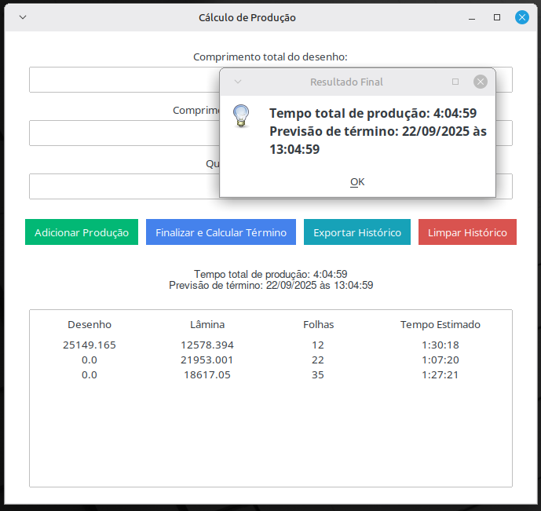

# Estimador de Tempo de Produção (Desktop App)

> Uma aplicação de desktop desenvolvida em Python para calcular o tempo total de produção de trabalhos em fila, considerando uma jornada de trabalho real com pausas e fins de semana.



---

## 🎯 Objetivo do Projeto

Esta ferramenta foi criada para resolver um problema prático: estimar com precisão a data e a hora de término de uma fila de produção. Diferente de um cálculo simples, este aplicativo simula o processo ao longo dos dias, oferecendo uma previsão realista que pode ser usada para o planejamento de entregas.

## ✨ Funcionalidades Principais

* **Interface Gráfica Intuitiva:** Construído com `ttkbootstrap`, o aplicativo oferece uma experiência de usuário limpa e moderna.
* **Fila de Produção:** Permite adicionar múltiplos trabalhos a uma lista, visualizando o histórico em uma tabela organizada.
* **Cálculo de Término Inteligente:** A principal funcionalidade do projeto. O cálculo da data e hora de finalização leva em conta:
    * Um turno de trabalho customizável (ex: 8:00 às 16:30).
    * Pausas programadas (almoço e café).
    * **Pula automaticamente fins de semana** (sábados e domingos).
* **Exportação para Excel:** Permite exportar todo o histórico da fila de produção para um arquivo `.xlsx` com um único clique.
* **Gerenciamento de Histórico:** Funções para adicionar e limpar a lista de produção.

---

## 🛠️ Tecnologias Utilizadas

* **Linguagem:** Python 3
* **Interface Gráfica (GUI):** Tkinter, ttkbootstrap
* **Manipulação de Arquivos:** openpyxl (para exportação Excel)
* **Lógica de Tempo:** datetime (biblioteca padrão do Python)

---

## 🚀 Como Rodar o Projeto Localmente

**Pré-requisito:** Ter o Python 3 instalado.

1.  **Clone o repositório:**
    ```bash
    git clone [https://github.com/SEU_USUARIO/NOME_DO_REPOSITORIO.git](https://github.com/SEU_USUARIO/NOME_DO_REPOSITORIO.git)
    cd NOME_DO_REPOSITORIO
    ```

2.  **Crie e ative um ambiente virtual:**
    ```bash
    # Para Linux/macOS
    python3 -m venv venv
    source venv/bin/activate

    # Para Windows
    python -m venv venv
    .\venv\Scripts\activate
    ```

3.  **Instale as dependências:**
    *Primeiro, certifique-se de ter um arquivo `requirements.txt`. Se não tiver, gere-o com o comando:*
    ```bash
    pip freeze > requirements.txt
    ```
    *Depois, instale as dependências:*
    ```bash
    pip install -r requirements.txt
    ```
---

## 📄 Licença

Este projeto está sob a licença MIT. Veja o arquivo `LICENSE` para mais detalhes.
